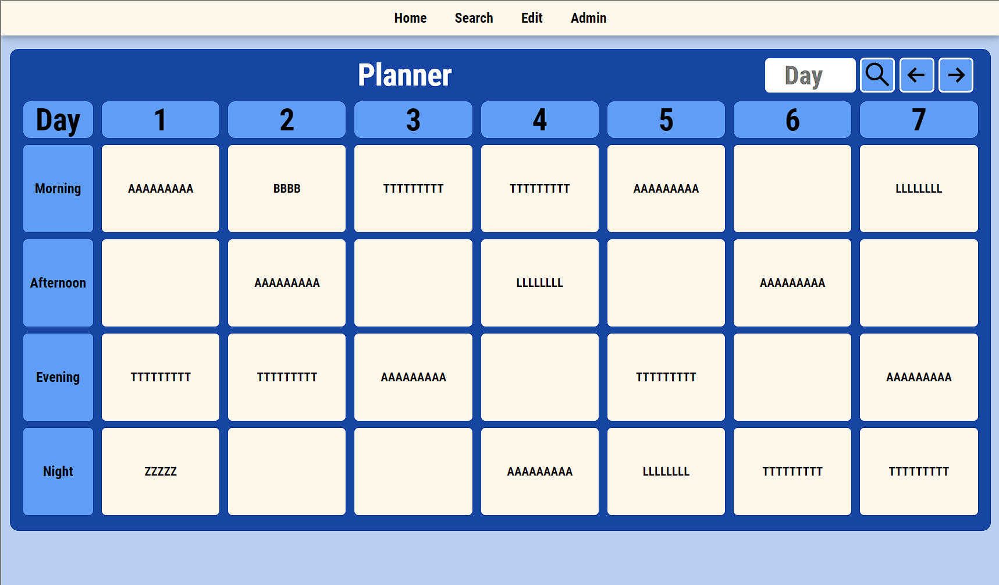
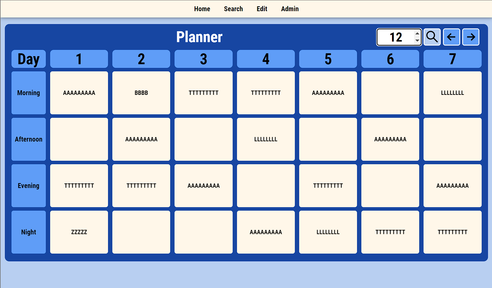
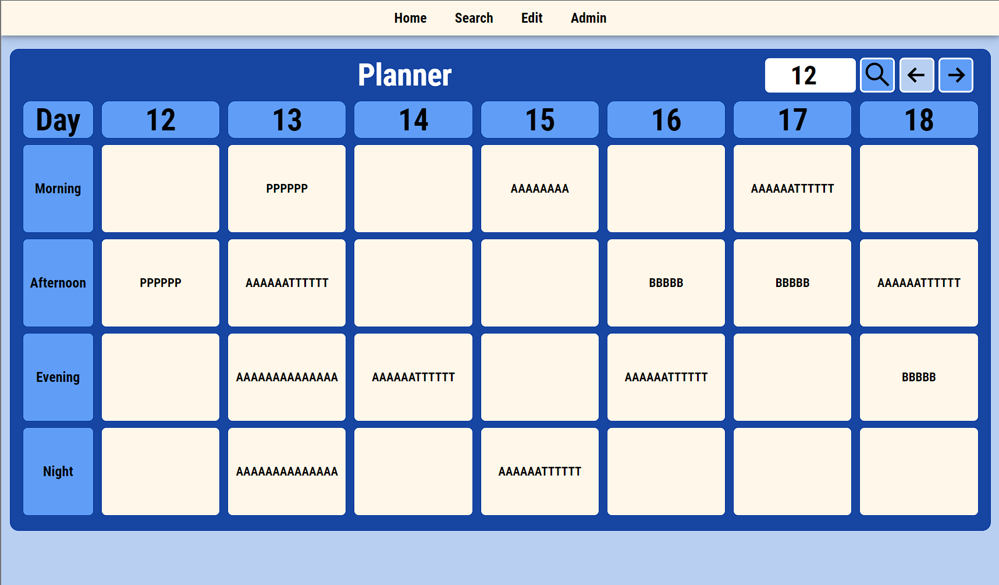
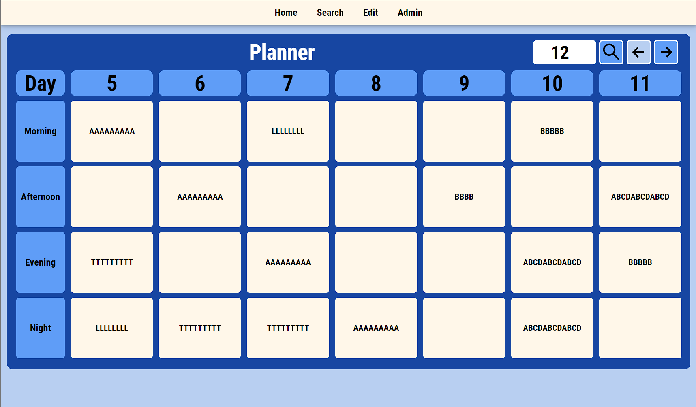
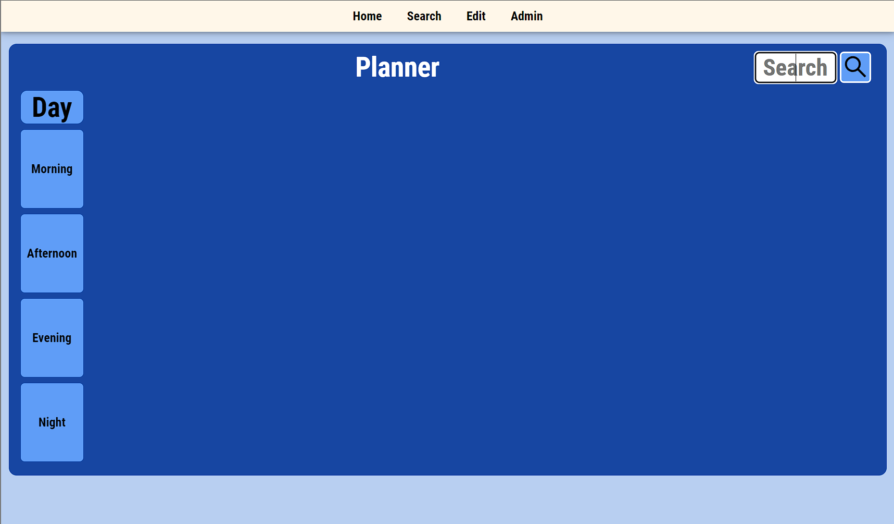
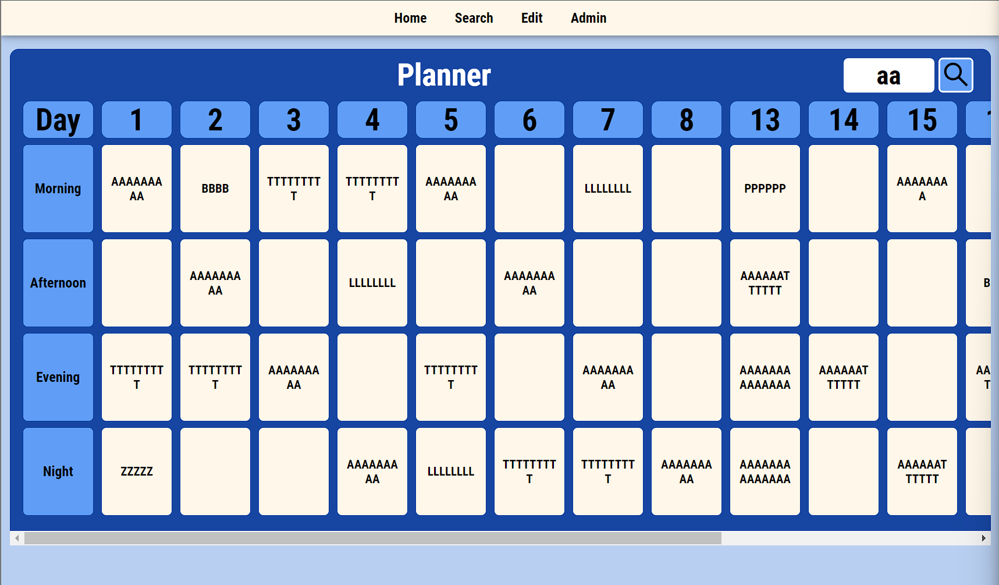
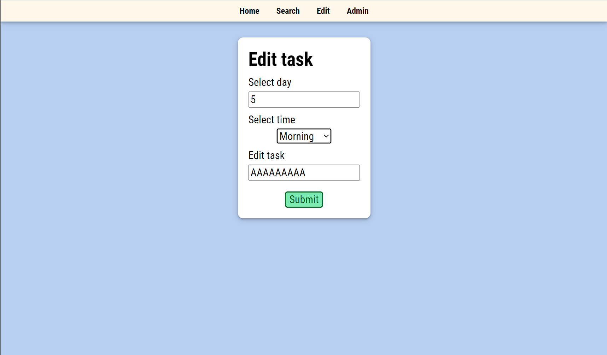
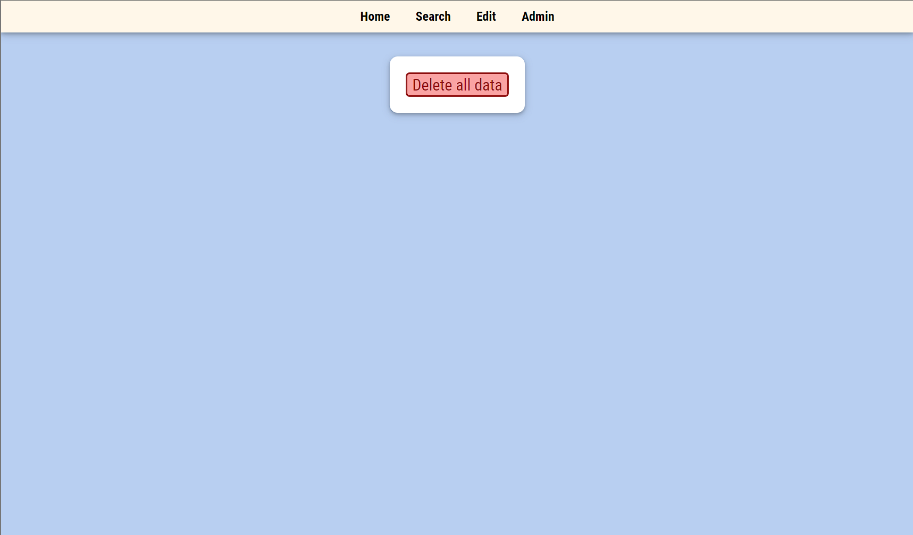

# Planner
Planner web application using MERN stack (MongoDB, Express, React, NodeJS)

## How to use the app

### Home page
- View planner and tasks in each days <br/>
 <br/>

- Type a number to view specific days. <br/>
 <br/>
 <br/>

- Click the arrow to view the planner for the previous or next 7 days <br/>
 <br/>
 <br/>

### Search page
- Type a word to view days that have relevant tasks <br/>
 <br/>
 <br/>

### Edit page
- Edit task in specific day and time <br/>
 <br/>

### Admin page
- Click to delete all planner data <br/>
 <br/>

## How to run the app
1. Download the code
2. Create .env file in /server/.env with
```
DATABASE=[MongoDB Connection String URI]
PORT=5500
```
3. Create .env file in /client/.env
```
REACT_APP_API=http://localhost:5500/api
```
3. Navigate to inside the project folder on terminal
Run npm install
Run npm start
View the app at http://localhost:3000/
